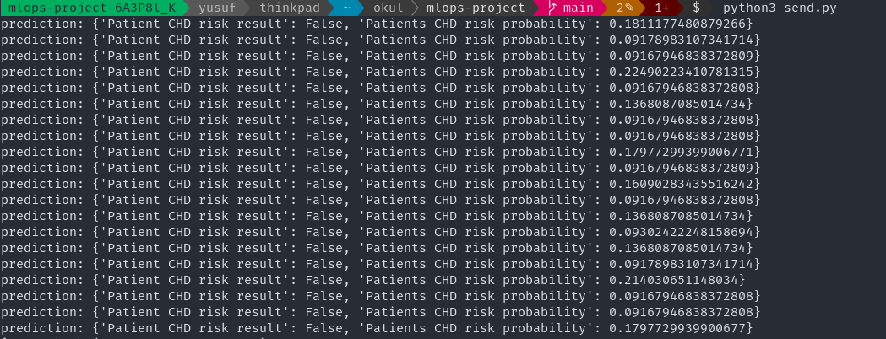
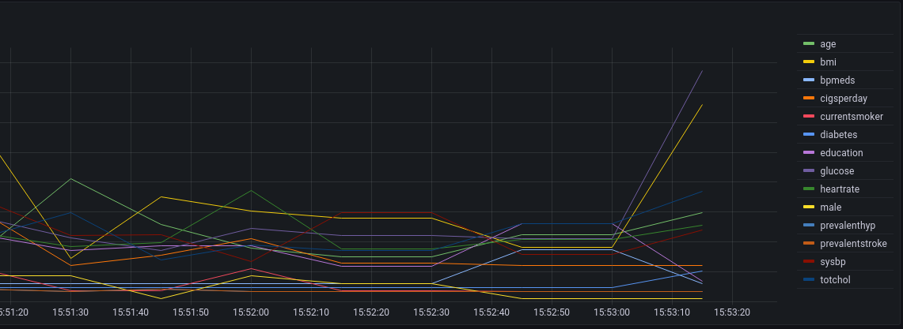

# ML-ops Zoomcamp Project

## Project Information:

In this project we are trying to detect Coronary heart disease risk in ten years.Given all patient medical history and detecting predictions risk of ten year CHD risk.It's classification problem can be solve logistic regression, decision tree and random forest.

## Variables Descriptions

 * **Sex:** male or female(Nominal)
* **Age:** Age of the patient;(Continuous - Although the recorded ages have been truncated to whole numbers, the concept of age is continuous)
Behavioral
* **Current Smoker:** whether or not the patient is a current smoker (Nominal)
* **Cigs Per Day:** the number of cigarettes that the person smoked on average in one day.(can be considered continuous as one can have any number of cigarettes, even half a cigarette.)
Medical( history)
* **BP Meds:** whether or not the patient was on blood pressure medication (Nominal)
* **Prevalent Stroke:** whether or not the patient had previously had a stroke (Nominal)
* **Prevalent Hyp:** whether or not the patient was hypertensive (Nominal)
* **Diabetes:** whether or not the patient had diabetes (Nominal)
Medical(current)
* **Tot Chol:** total cholesterol level (Continuous)
* **Sys BP:** systolic blood pressure (Continuous)
* **Dia BP:** diastolic blood pressure (Continuous)
* **BMI:** Body Mass Index (Continuous)
* **Heart Rate:** heart rate (Continuous - In medical research, variables such as heart rate though in fact discrete, yet are considered continuous because of large number of possible values.)
* **Glucose:** glucose level (Continuous)
* **Target Variable:** 10 year risk of coronary heart disease CHD (binary: “1”, means “Yes”, “0” means “No”)


**Data and variable source**:  [Kaggle](https://www.kaggle.com/dileep070/heart-disease-prediction-using-logistic-regression)


# Services

There are three Services in the Project. Training Service, Prediction Service and Monitoring Service. Training Service uses hyperopt for searching best parameters for model and register model as "chd_risk_model" with mlflow. Training service and prediction services shares same docker volume. With these method I can load best model with just registered model name.


## Running Project

```bash
git clone https://github.com/yusyel/mlops-project.git
```

```bash
cd mlops-project
```

```bash
pipenv install --dev
```

* There is Makefile for running pylint, isort, black and docker-compose

```bash
make build
```

When the model is trained prefect log shows:
```bash
NFO mlflow.tracking._model_registry.client: Waiting up to 300 seconds for model version to finish creation.                     Model name: chd_risk_model, version 1 | Created version '1' of model 'chd_risk_model'.
```
For sending data for prediction service there is a ```send.py``` python file

```bash
python3 send.py
```


Now we can look monitoring service using Grafana

```bash
http://localhost:3000/
```


